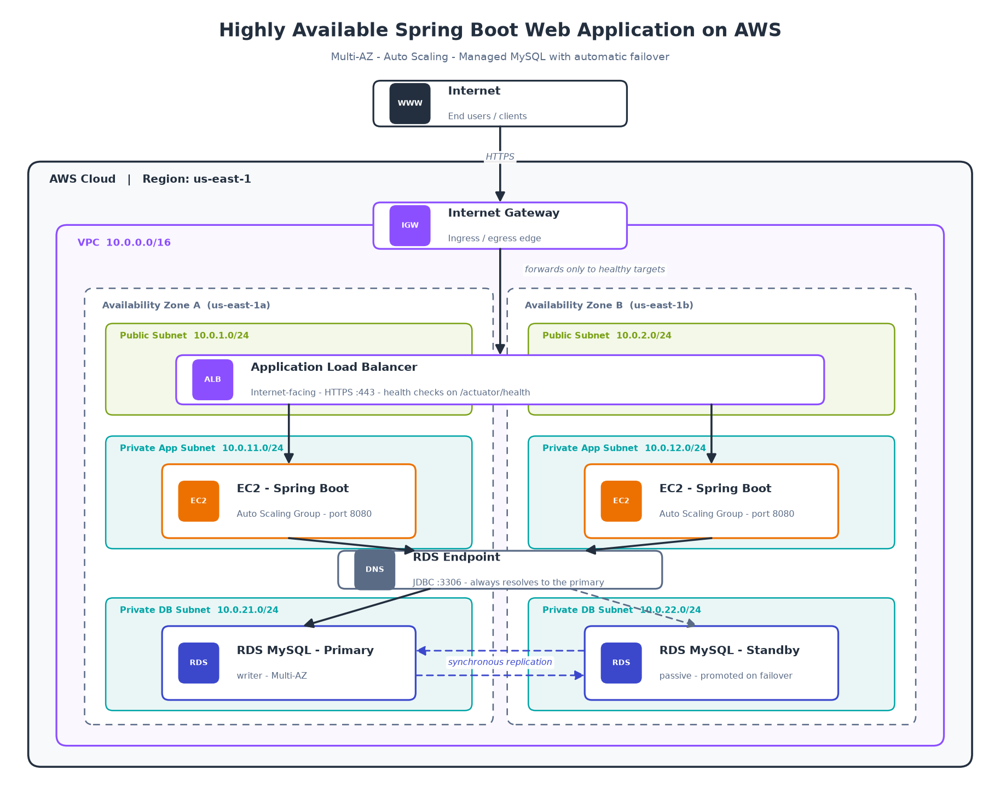

# Highly Available Spring Boot Web Application on AWS

A reference architecture for running a Spring Boot application on AWS with no single
point of failure. Every tier — load balancing, compute, and data — is spread across
two Availability Zones, so the loss of an entire AZ degrades capacity but does not
cause an outage.



**To build it:** follow the [Implementation Guide](docs/IMPLEMENTATION-GUIDE.md), a
phased walkthrough of the AWS Console from an empty account to a verified deployment.

## Request flow

1. A client resolves the application's DNS name and opens an HTTPS connection.
2. The **Internet Gateway** is the VPC's edge, allowing traffic to reach resources
   with public IP addresses.
3. The **Application Load Balancer** has a network interface in the public subnet of
   each AZ. It terminates TLS and forwards each request to a healthy target.
4. An **EC2 instance** in a private app subnet handles the request in the Spring Boot
   process listening on port 8080.
5. The application opens a JDBC connection to the **RDS endpoint**, a DNS name that
   always points at whichever instance is currently the primary.
6. **RDS MySQL** serves the query from the primary, synchronously replicating every
   committed write to the standby in the other AZ.

## Network layout

The VPC is `10.0.0.0/16`, subdivided into three tiers across two AZs. Splitting by
tier rather than by function alone means routing and security rules can be applied to
a whole layer at once.

| Tier | AZ A | AZ B | Routing |
| --- | --- | --- | --- |
| Public | `10.0.1.0/24` | `10.0.2.0/24` | Default route to the Internet Gateway |
| Private app | `10.0.11.0/24` | `10.0.12.0/24` | Default route to a NAT Gateway |
| Private database | `10.0.21.0/24` | `10.0.22.0/24` | No default route to the internet |

Only the load balancer lives in the public subnets. The EC2 instances have no public
IP addresses and cannot be reached directly from the internet — they reach out for
package updates and AWS API calls through a NAT Gateway, and inbound traffic arrives
only via the load balancer. The database subnets are fully isolated with no route off
the VPC at all.

## Components

### Application Load Balancer

The ALB is the single entry point and the component that makes the compute tier
replaceable. It runs continuous health checks against `/actuator/health` on every
registered instance and stops sending traffic to any target that fails, so a hung or
crashed JVM stops receiving requests within seconds. Because it is a managed service
with nodes in both public subnets, the load balancer itself survives an AZ failure.

### EC2 Auto Scaling Group

The application instances belong to an Auto Scaling Group spanning both private app
subnets, with a minimum capacity of two. This is what makes the tier self-healing:
when an instance fails its health check or its underlying hardware disappears, the
ASG terminates it and launches a replacement from the same launch template. Because
the ASG balances capacity across AZs, losing one AZ leaves the other still serving
traffic while replacements come up.

Instances are treated as disposable — no request state is stored on local disk, so
any instance can serve any request and be replaced at any time.

### RDS MySQL Multi-AZ

The database runs as a Multi-AZ deployment: a primary instance in one AZ and a
standby in the other. Every write is committed to both before the transaction is
acknowledged, so the standby is never behind. Applications connect to a DNS endpoint
rather than an instance address.

If the primary fails, RDS promotes the standby and repoints the endpoint DNS record,
typically within one to two minutes. The application does not need to know a failover
happened, though connection pools should be configured to retry so in-flight
connections are re-established cleanly rather than surfacing errors to users.

Note that the standby does not serve reads — it exists purely for availability. Read
replicas are a separate feature and would be the answer to read scaling.

## Security model

Security groups are chained so each tier only accepts traffic from the one in front
of it, rather than from an IP range:

- The **ALB security group** accepts `443` from the internet.
- The **application security group** accepts `8080` only from the ALB's security
  group.
- The **database security group** accepts `3306` only from the application's security
  group.

This means a compromised web instance cannot be used to scan the database tier from
an arbitrary address, and the rules stay correct as instances are replaced and their
IP addresses change.

Additional controls worth applying: encryption at rest on the RDS volume, TLS in
transit for database connections, database credentials stored in AWS Secrets Manager
rather than baked into an AMI or environment file, and SSM Session Manager for shell
access instead of a bastion host with open SSH.

## How the design handles failure

| Failure | Effect | Recovery |
| --- | --- | --- |
| One EC2 instance crashes | ALB stops routing to it | ASG replaces it automatically |
| One Availability Zone fails | Capacity halves | Surviving AZ serves traffic; ASG scales up; RDS fails over if the primary was there |
| RDS primary fails | Brief write interruption | Standby is promoted, endpoint DNS is updated |
| Traffic spike | — | ASG scales out on CPU or request count |

The scenario this design does *not* cover is a full region failure. That requires
cross-region replication and DNS failover, which is a significant step up in cost and
operational complexity.

## Cost considerations

The main recurring costs are the two EC2 instances, the ALB, and RDS. Two components
are worth calling out because they are easy to under-budget: **Multi-AZ RDS roughly
doubles the database bill** since you pay for the standby you never query, and **NAT
Gateways are billed hourly per AZ plus per GB processed**, which for a low-traffic
application can exceed the cost of the instances they serve.

For a development environment, running single-AZ RDS and replacing NAT Gateways with
VPC endpoints (or placing instances in public subnets behind strict security groups)
preserves the shape of the architecture at a fraction of the cost.

## Regenerating the diagram

The diagram is generated from code so it stays in version control and can be updated
without a drawing tool. Both `docs/architecture.png` and `docs/architecture.svg` are
written from a single script:

```bash
pip install matplotlib
python docs/generate_diagram.py
```

## Repository layout

```
.
├── README.md                       # this file - the architecture and why
├── docs
│   ├── IMPLEMENTATION-GUIDE.md     # step-by-step AWS Console build
│   ├── generate_diagram.py         # source of truth for the diagram
│   ├── architecture.png
│   └── architecture.svg
└── scripts
    └── user-data.sh                # EC2 bootstrap for the launch template
```

## Next steps

The console guide produces a working stack but nothing reproducible. The natural
follow-on is to express the same resources as Terraform or CloudFormation, and to
replace the manual JAR upload with a CI pipeline that builds, publishes to S3, and
triggers an Auto Scaling Group instance refresh.
